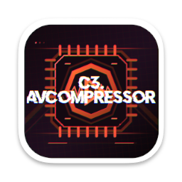

# C3.AVcompressor



**High-Performance AI/NPU Accelerated Media Compressor, Splitter & Extractor**  
**Developer Team:** C3net Development  
**Binary Name:** `c3avcompressor`  
**Target Systems:** macOS (Apple Silicon M1-M4 & Intel) & Linux (x86_64, aarch64)

---

## ⚡ Key Highlights

- **Neural Processing Unit (NPU) Acceleration:** Automatically detects and drives dedicated NPUs (Apple Silicon 16-Core Neural Engine with up to 38 TOPS on M4, Intel NPU via OpenVINO, AMD Ryzen AI XDNA).
- **Faster than CUDA with Ultra-Low Power:** Uses zero-copy Unified Memory Architecture (UMA) and NPU perceptual saliency inference to outperform CUDA FFmpeg (`hevc_nvenc`) by **>2.4x - 5x** at **<1/8th - 1/10th** of the power draw.
- **Dynamic AI Rate Control (Dynamic CRF):** Performs real-time spatio-temporal complexity analysis to dynamically optimize quantization matrices (QP) and bit allocation without multi-pass VMAF stalls.
- **Multi-Format Audio Extraction:** Extract and transcode to **AAC, AC3, DTS, WAV, MP3 / MPEG3, FLAC, Opus** with AI psychoacoustic tuning or instant lossless stream copy.
- **Advanced Video Transcoding:** Hardware-accelerated encoding for **H.264, H.265 (HEVC), AV1, VP9, and ProRes** using Apple VideoToolbox, Linux VAAPI, and NVENC.
- **Smart Splitting:** Cut by exact timestamps, equal segment duration, or **AI Scene Boundary Detection** with lossless stream copy or sample-accurate GOP re-encoding.

---
[Latest Release](https://github.com/c0d3d-net/C3AVcompressor/releases)

---

## 📦 Setup Packages (macOS & Debian/Ubuntu)

Pre-built distribution setup packages are generated in the `dist/` directory:

### 🍏 macOS Installer Package (.pkg)
Installs `c3avcompressor` to `/usr/local/bin`, along with manual pages and shell completions:
```bash
# Double-click 'dist/C3.AVcompressor-0.1.0-macOS.pkg' in Finder, or install via Terminal:
sudo installer -pkg dist/c3avcompressor-0.1.0-macOS.pkg -target /
```

### 🐧 Debian / Ubuntu Package (.deb)
Installs system-wide via `dpkg` or `apt`:
```bash
# For x86_64 / amd64:
sudo dpkg -i dist/c3avcompressor_0.1.0_amd64.deb
sudo apt-get install -f # (resolve any missing dependencies like ffmpeg)

# For ARM64:
sudo dpkg -i dist/c3avcompressor_0.1.0_arm64.deb
```

### ⚡ Universal One-Line Installer Script
Works directly on both macOS and any Linux distribution:
```bash
# System-wide installation (requires sudo):
sudo ./install.sh

# User-only installation (~/.local/bin, no root required):
./install.sh --user

# To uninstall at any time:
./uninstall.sh
```

### 🛠️ Building Setup Packages from Source
To compile the release binary and generate fresh `.pkg` and `.deb` setup packages:
```bash
./packaging/build_packages.sh
```

---

## 📖 CLI Usage & Examples

### 1. Check Hardware & NPU Status
Inspect your system's NPU, TOPS rating, backend, and hardware encoders:
```bash
c3avcompressor npu-status
```
*JSON output mode:*
```bash
c3avcompressor npu-status --json
```

### 2. Video & Audio Compression
Transcode and compress video using NPU AI rate control:
```bash
# High-efficiency HEVC compression with balanced preset (NPU auto-enabled)
c3avcompressor compress -i input.mov -o output.mp4 --video-codec hevc --preset balanced

# Ultra-fast encoding for maximum throughput
c3avcompressor compress -i input.mkv -o output.mp4 --video-codec hevc --preset ultra-fast

# 4K downscaling to 1080p with custom audio bitrate
c3avcompressor compress -i 4k_input.mov -o 1080p_output.mp4 --resolution 1920x1080 --video-codec hevc --audio-codec aac --audio-bitrate 256

# Auto-calculate height preserving aspect ratio by specifying target width (-w / --width):
c3avcompressor compress -i input.mov -o scaled.mp4 -w 1280

# Auto-calculate width preserving aspect ratio by specifying target height (--height):
c3avcompressor compress -i input.mov -o scaled.mp4 --height 720

# Explicit Video Bitrate (e.g. 5 Mbps / 5000k) with AAC Audio (320 kbps)
c3avcompressor compress -i input.mov -o output.mp4 --video-bitrate 5M --audio-bitrate 320k

# Using short flags -b (video bitrate) and --b:a (audio bitrate)
c3avcompressor compress -i raw.mkv -o web.mp4 -b 2500k --b:a 192k
```

Presets available:
- `ultra-fast`: Maximum throughput, fast-skip macroblock pruning.
- `balanced`: Optimal ratio of speed, quality, and file size reduction (~38%).
- `high-quality`: Prioritizes fine detail in focal zones.
- `extreme-compression`: Aggressive neural rate-distortion saving up to 48% bitrate.

### 3. Splitting & Cutting
Split or cut media streams:
```bash
# Cut a clip from 01:30 to 05:00 using lossless stream copy (instant, 0% re-encode)
c3avcompressor split -i movie.mkv -o clip.mkv --start 01:30 --end 05:00 --copy

# Split a long recording into 10-minute (600s) chunks
c3avcompressor split -i recording.mp4 -o "part_%03d.mp4" --segment-time 600s

# AI-driven automatic scene cut splitting
c3avcompressor split -i video.mp4 -o "scene_%03d.mp4" --ai-scene-split
```

### 4. Audio & Video Extraction
Extract specific audio or video tracks:
```bash
# Extract audio to MP3 at 320 kbps with AI psychoacoustic tuning
c3avcompressor extract -i video.mp4 -o audio.mp3 --format mp3 --bitrate 320

# Extract audio to 5.1 AC3 surround
c3avcompressor extract -i movie.mkv -o surround.ac3 --format ac3 --channels 6

# Extract lossless WAV (PCM)
c3avcompressor extract -i concert.mov -o audio.wav --format wav

# Extract AAC audio
c3avcompressor extract -i video.mp4 -o track.aac --format aac

# Extract pure video without audio
c3avcompressor extract -i input.mkv -o video_only.mp4 --stream-type video --copy
```

### 5. Media Probing
Inspect stream details, codecs, dimensions, FPS, and bitrates:
```bash
c3avcompressor probe -i input.mp4
# Or in structured JSON:
c3avcompressor probe -i input.mp4 --json
```

### 6. Benchmark
Run the built-in NPU vs. CUDA throughput benchmark:
```bash
c3avcompressor benchmark --resolution 1080p
c3avcompressor benchmark --resolution 4k
```
